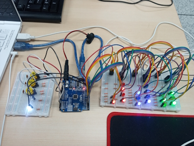
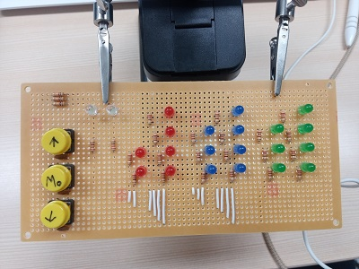
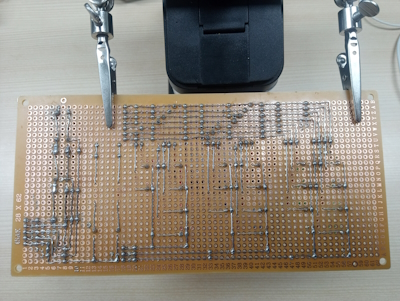

# Information of this program
Name: binary-clock\
Maker: hamihauya\
Create date: 2023-03-12\
Modified date: 2023-06-20\
User lang set: English

# Examples
## Breadboard ##
\

## Perfboard ##
\
\
Flip direction: ↕

# How to use this product #
Red: Hour\
Blue: Minute\
Green: Second\
\
Up button\
White: View of time unit which can be changed now by user\
____00 - No power\
____10 - Hour\
____11 - Minute\
____01 - Second\
Down button

# Needs to this product
## Input page ##
3 counts of 4-leg switch\
3 counts of 10k Ohm resistor\
3 counts of 10u Farad condensor\
2 counts of white LED\
2 counts of 220 Ohm resistor
## Main ##
1 count of Arduino UNO
## Output page ###
6 counts of red LED\
6 counts of 220 Ohm resistor\
7 counts of green LED\
7 counts of 220 Ohm resistor\
7 counts of blue LED\
7 counts of 220 Ohm resistor

# Map of circuit
[circuit_map.jpg](images/circuit_map.jpg)
